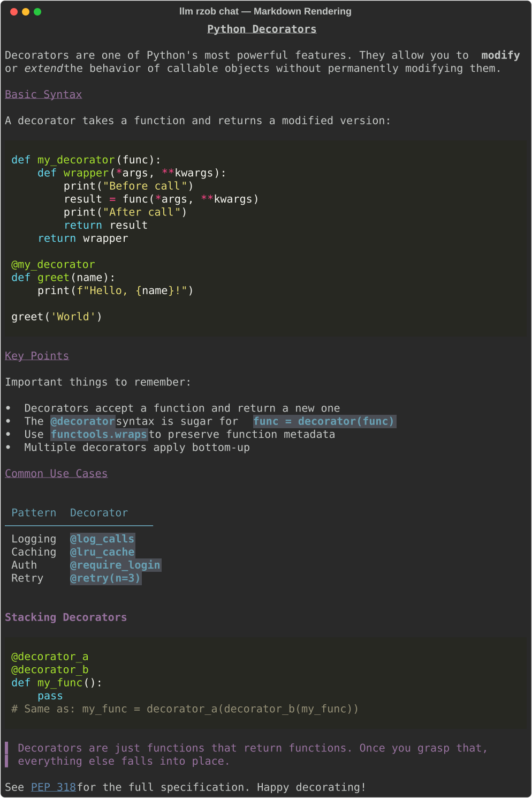

# llm-fcio

An [llm](https://llm.datasette.io/) CLI plugin for the [FCIO AI platform](https://ai.rzob.fcio.net/openai/v1) — OpenAI-compatible endpoints on AMD hardware, supporting multiple locations.

## Setup

```bash
# Install the plugin
llm install llm-fcio

# Set your API key (rzob location by default)
llm keys set fcio-rzob

# Fetch and cache available models
llm fcio refresh
```

Alternatively, set the `FCIO_RZOB_API_KEY` environment variable instead of using `llm keys set`.

## Locations

The plugin supports three FCIO locations. Use `-l`/`--location` to select one (default: `rzob`):

| Location | API Base | Key name | Env variable |
|---|---|---|---|
| `rzob` | `https://ai.rzob.fcio.net/openai/v1` | `fcio-rzob` | `FCIO_RZOB_API_KEY` |
| `dev` | `https://ai.dev.fcio.net/openai/v1` | `fcio-dev` | `FCIO_DEV_API_KEY` |
| `whq` | `https://ai.whq.fcio.net/openai/v1` | `fcio-whq` | `FCIO_WHQ_API_KEY` |

```bash
# Set keys for additional locations
llm keys set fcio-dev
llm keys set fcio-whq

# Refresh models for a specific location
llm fcio -l dev refresh
llm fcio -l whq refresh
```

Model IDs include the location prefix: `fcio-rzob/...`, `fcio-dev/...`, `fcio-whq/...`.

## Chat Models

After running `llm fcio refresh`, chat models are available via the standard `llm` interface:

```bash
# One-shot prompt
llm -m fcio-rzob/gpt-oss-20b "Explain transformers in 3 sentences"

# With options
llm -m fcio-rzob/gpt-oss-20b -o temperature 0.3 -o max_tokens 500 "Summarize this"

# Interactive conversation
llm chat -m fcio-rzob/gpt-oss-20b

# System prompt
llm -m fcio-rzob/gpt-oss-120b -s "You are a helpful math tutor" "What is 2+2?"

# Use a different location
llm -m fcio-dev/gpt-oss-20b "Hello from dev"
```

### Available Chat Models (rzob)

| Model ID | Alias | Description |
|---|---|---|
| `gpt-oss:20b` | `20b` | Default, fast |
| `gpt-oss:120b` | `120b` | Larger, more capable |

Short aliases (`20b`, `120b`) are only registered for the `rzob` location.

### Model Options

- `temperature` (float, 0–2) — sampling temperature
- `max_tokens` (int) — max tokens in response
- `top_p` (float, 0–1) — nucleus sampling
- `tools` — tool definitions forwarded to the API
- `response_format` — JSON mode and structured output configuration

## Embedding Models

Embedding models integrate with `llm embed`, `llm embed-multi`, and `llm similar`:

```bash
# Single embedding
llm embed -m bge -c "Hello world"

# Batch embed files into a collection
llm embed-multi --files ./src "*.py" --collection my-code -m bge

# Semantic search
llm similar my-code -c "authentication logic"
```

### Available Embedding Models (rzob)

| Model ID | Alias | Dimensions |
|---|---|---|
| `bge-m3:567m` | `bge` | 1024 |
| `Nomic-embed-text:v1.5` | `nomic` | — |
| `embeddinggemma:300m` | `gemma` | — |

### Ingesting Files with Chunking

`llm fcio ingest` splits files into line-based overlapping chunks, respects `.gitignore`, and embeds them into an llm collection:

```bash
# Ingest all markdown files in current directory (recursive)
llm fcio ingest my-project .

# Preview before embedding (default behavior)
llm fcio ingest my-project ./src/ --glob "*.py"

# Explicit files, custom chunk size
llm fcio ingest my-project README.md CONTRIBUTING.md --chunk-size 50

# Skip confirmation
llm fcio ingest my-project ./docs/ --yes

# Full options
llm fcio ingest my-project ./src/ --glob "*.py" -m bge --chunk-size 50 --overlap 10 --yes
```

Defaults: `--glob *.md`, `-m bge-m3-567m`, `--chunk-size 30`, `--overlap 5`. Files matching `.gitignore` patterns and common directories (`venv/`, `.venv/`, `node_modules/`, `__pycache__/`, `.git/`) are excluded automatically.

Chunk IDs encode file path and line range (e.g. `src/main.py:42-71`), enabling precise similarity results.

### Example: Ingesting a Python Project

```bash
# Create collection and ingest markdown docs
llm fcio ingest my-project . --glob "*.md" --yes

# Add Python source files to the same collection
llm fcio ingest my-project . --glob "*.py" --chunk-size 50 --overlap 10 --yes

# Search across both code and docs
llm similar my-project -c "how does error handling work"
```

Both invocations write into the same `my-project` collection. A single `llm similar` query then searches across code, tests, and documentation.

```bash
# Check what's in a collection
llm collections list

# Delete and rebuild
llm collections delete my-project
```

For simple one-file-one-embedding use cases, `llm embed-multi --files` still works (see above).

## CLI Commands

### Markdown Rendering

`llm fcio chat` renders markdown responses with syntax highlighting, headings, tables, and formatting:



The plugin adds the `llm fcio` command group:

```bash
llm fcio refresh              # Fetch models from API, cache locally
llm fcio models               # List all models with type (chat/embed)
llm fcio models --filter oss  # Filter models by name
llm fcio models --json        # Raw JSON output

llm fcio chat "Hello"         # Quick chat with Rich markdown rendering
llm fcio chat -m 120b "Hi"   # Use specific model
llm fcio chat -i              # Interactive chat mode
llm fcio chat -s "Be terse" "Explain DNS"
llm fcio chat --no-markdown "Hello"  # Raw output (no formatting)

llm fcio embed bge "some text"            # Test embedding
llm fcio embed bge "text1" "text2" --json # Multiple texts, raw JSON

llm fcio ingest my-project .                         # Embed .md files (chunked, with preview)
llm fcio ingest my-project ./src/ --glob "*.py" --yes # Embed Python files, no preview

llm fcio health               # Check API connectivity and auth
llm fcio tokens gpt-oss:20b "count these tokens"

# Location-specific commands
llm fcio -l dev refresh       # Refresh models for dev location
llm fcio -l dev health        # Health check for dev
llm fcio -l whq models        # List models on whq

# Simulate streaming (location-independent)
llm fcio simulate             # Demo streaming with Rich rendering
llm fcio simulate --raw       # Raw markdown output
```

### Fuzzy Model Matching

Model names in `fcio chat` support fuzzy matching via [fzf](https://github.com/junegunn/fzf). Pass a substring and if there's a single match, it resolves automatically. Without fzf, substring matching still works for unambiguous cases.

## Configuration

| Setting | Value |
|---|---|
| Default location | `rzob` |
| Model cache | `~/.llm/fcio_models_{location}.json` |
| Default chat model | `gpt-oss:20b` |
